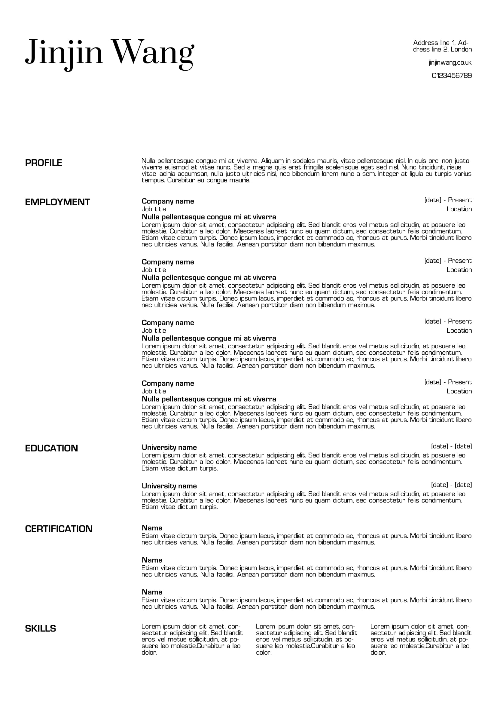

# CV Generator 🦾

A CV generator powered by React-pdf and Sanity.io, for creating and updating CVs using the template provided.

## Motivation

Updating CV in Adobe Illustrator (where my CVs used to live) can easily mess up spacing and don't support grammar/spelling checking.

## What does the template look like?



## Installation

1. Install packages in `cv-pdf` and `cv-studio`:

```sh
yarn install
```

2. Get your project ID by creating a new Sanity studio by following [the Sanity doc](https://www.sanity.io/docs/getting-started).

3. In `cv-studio`, create a `.env.development` file and add the the project ID and dataset name:

```sh
SANITY_STUDIO_API_PROJECT_ID=[your-project-id]
SANITY_STUDIO_API_DATASET=[dataset-for-development-mode]
```

4. In `cv-pdf`, create a `.env` file and add the the project ID and dataset name:

```sh
NEXT_PUBLIC_SANITY_STUDIO_API_PROJECT_ID=[your-project-id]
NEXT_PUBLIC_SANITY_STUDIO_API_DATASET=[dataset-for-development-mode]
```

## Running the project

### `cv-pdf`

```sh
yarn workspace cv-pdf start
```

### `cv-studio`

```sh
yarn workspace cv-studio start
```

## Using the generator

Create/edit the CV in Sanity studio -> Use the link on the homepage of the app -> Preview or download the PDF 👐
